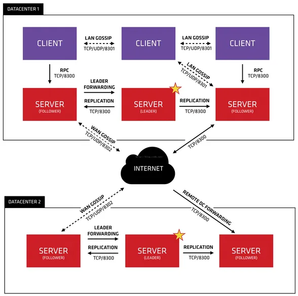
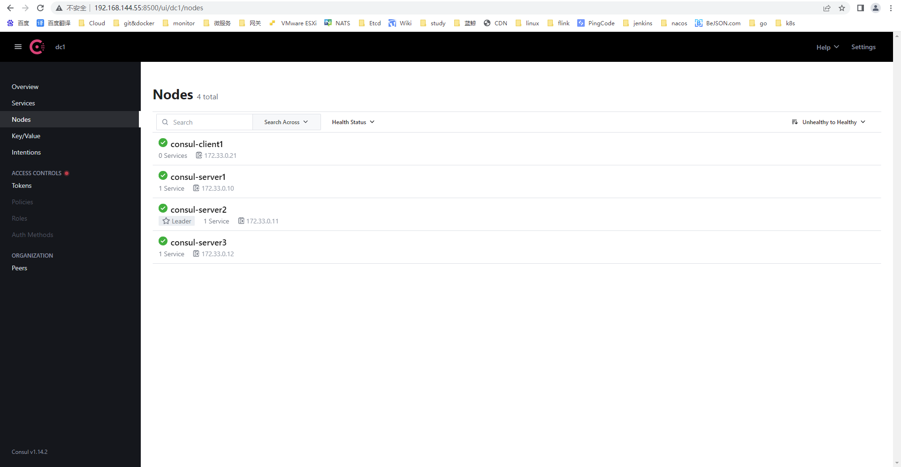
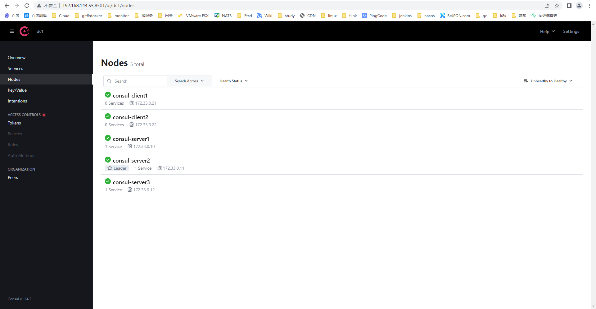
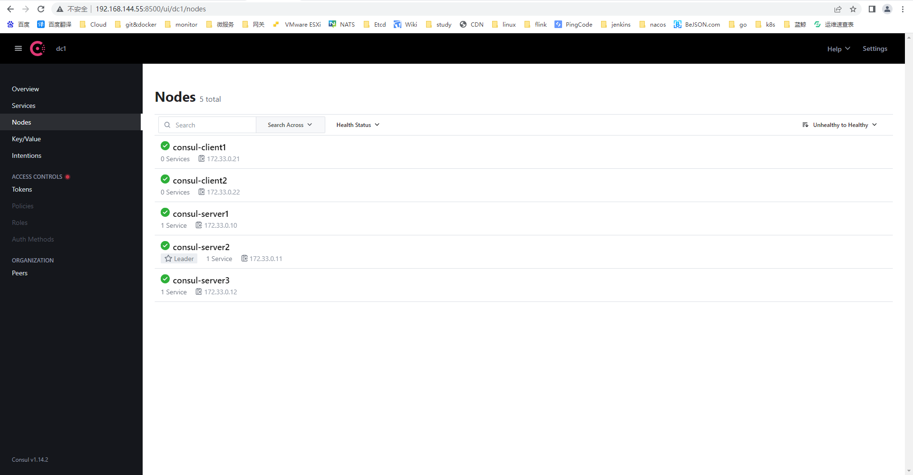

# <center>Consul学习笔记 </center>

​																																																									            ——by 王浩

[TOC]

# 一、Consul的概述

## 1、Consul的简介

Consul是HashiCorp公司推出的开源工具，用于实现分布式系统的服务发现与配置。 Consul是分布式的、高可用的、可横向扩展的。Consul是一个服务网格解决方案，提供了一个功能齐全的控制平面，具有服务发现、配置和分段功能。这些功能中的每一项都可以根据需要单独使用，也可以一起使用来构建一个完整的服务网格。Consul需要一个数据平面，并支持代理和原生集成模型。Consul提供了一个简单的内置代理，因此一切都可以开箱即用，但也支持第三方代理集成，如Envoy。

## 2、Consul的常用术语

| 术语       | 说明                                                         |
| ---------- | ------------------------------------------------------------ |
| Agent      | agent是一直运行在Consul集群中每个成员上的守护进程。通过运行consul agent来启动。agent可以运行在client或者server模式。指定节点作为client或者server是非常简单的，除非有其他agent实例。所有的agent都能运行DNS或者HTTP接口，并负责运行时检查和保持服务同步。 |
| Client     | 一个Client是一个转发所有RPC到server的代理。这个client是相对无状态的。client唯一执行的后台活动是加入LAN gossip池。这有一个最低的资源开销并且仅消耗少量的网络带宽。 |
| Server     | 一个server是一个有一组扩展功能的代理，这些功能包括参与Raft选举，维护集群状态，响应RPC查询，与其他数据中心交互WAN gossip和转发查询给leader或者远程数据中心。 |
| DataCenter | 数据中心的定义似乎是显而易见的，有一些细节是必须考虑的。例如，在EC2，多个可用性区域是否被认为组成了单一的数据中心？数据中心是在同一个网络环境中——私有的，低延迟，高带宽。这不包括基于公共互联网环境，但是对于consul而言，在同一个EC2的多个可用性区域会被认为是一个的数据中心。 |
| Consensus  | 使用Consensus来表明就leader选举和事务的顺序达成一致。由于这些事务都被应用到有限状态机上，Consensus暗示复制状态机的一致性。 |
| Gossip     | Consul建立在Serf的基础之上，它提供了一个用于多播目的的完整的gossip协议。Serf提供成员关系，故障检测和事件广播。更多的信息在gossip文档中描述。这足以知道gossip使用基于UDP的随机的点到点通信。 |
| LAN Gossip | 它包含所有位于同一个局域网或者数据中心的所有节点。           |
| WAN Gossip | 它只包含Server。这些server主要分布在不同的数据中心并且通常通过因特网或者广域网通信。 |
| RPC        | 远程过程调用。这是一个允许client请求server的请求/响应机制。RPC通过减少从一个地方到另一个地方的分组信息传输的时间段来解决延迟高的问题。 |

### （1）Gossip

* 背景

Gossip算法如其名，灵感来自办公室八卦，只要一个人八卦一下，在有限的时间内所有的人都会知道该八卦的信息，这种方式也与病毒传播类似，因此Gossip有众多的别名“闲话算法”、“疫情传播算法”、“病毒感染算法”、“谣言传播算法”。Gossip协议主要是基于UDP，实现任意node-to-node间的通信。

* 特点

在一个有界网络中，每个节点都随机地与其他节点通信，经过一番杂乱无章的通信，最终所有节点的状态都会达成一致。每个节点可能知道所有其他节点，也可能仅知道几个邻居节点，只要这些节可以通过网络连通，最终他们的状态都是一致的，当然这也是疫情传播的特点。要注意到的一点是，即使有的节点因宕机而重启，有新节点加入，但经过一段时间后，这些节点的状态也会与其他节点达成一致，也就是说，Gossip天然具有分布式容错的优点。

* 通信方式

如果把两个节点数据同步一次定义为一个周期，则在一个周期内，push需通信1次，pull需2次，push/pull则需3次，从效果上来讲，push/pull最好，理论上一个周期内可以使两个节点完全一致。两个节点（A、B）之间存在三种通信方式：

| 通信方式  | 说明                                                         |
| --------- | ------------------------------------------------------------ |
| push      | A节点将数据(key,value,version)及对应的版本号推送给B节点，B节点更新A中比自己新的数据，一般拥有新信息的节点才会作为发起节点。 |
| pull      | A仅将数据key,version推送给B，B将本地比A新的数据（Key,value,version）推送给A，A更新本地，一般无新信息的节点才会作为发起节点。 |
| push/pull | 与pull类似，只是多了一步，A再将本地比B新的数据推送给B，B更新本地。 |

## 3、Consul的角色

### （1）Client

客户端，无状态，将HTTP和DNS接口请求转发给局域网内的服务端集群。

### （2）Server

服务端，保存配置信息，存储和复制数据的地方，Server本身会选出一个Leader。虽然Consul可以用一台Server来运作，但建议使用3到5台，以避免故障情况导致数据丢失。建议每个数据中心采用Consul服务器集群。。

## 4、Consul的架构



* Consul支持多数据中心，在上图中有两个数据中心（DateCenter），数据中心之间通过Internet互联，为了提高通信效率，只有Server节点才能加入跨数据中心的通信。
* 在单个数据中心中，Consul分为Client和Server两种节点（所有的节点被称为Agent）。Server节点保存数据，推荐数量是3个或者5个，这是基于有故障情况下的可用性和性能之间的权衡结果，因为越多的机器加入达成共识越慢。然而，并不限制client的数量，它们可以很容易的扩展到数千或者数万台。Client节点负责健康检查及转发数据请求到Server。
* Server节点包含一个Leader和多个Follower，Leader节点会将数据同步到Follower，在Leader挂掉的时候会启动选举机制产生一个新的Leader。leader负责处理所有的查询和事务。作为一致性协议的一部分，事务也必须被复制到所有其他的节点。因为这一要求，当一个非leader得server收到一个RPC请求时，它将请求转发给集群leader。
* 集群内的Consul节点通过gossip协议维护成员关系，也就说某个节点想了解集群内现在还有哪些节点，这些节点是Client还是Server。单个数据中心的gossip协议同时使用TCP和UDP通信，并且都使用8301端口。跨数据中心的gossip协议也同时使用TCP和UDP通信，端口使用8302。集群内数据的读写请求既可以直接发到Server，也可以通过Client使用RPC转发到Server，请求最终会到达Leader节点，集群内数据的读写和复制都是通过TCP的8300端口完成的。

## 5、Consul的优势

* 使用Raft算法来保证一致性，比复杂的Paxos算法更直接.。相比较而言,，zookeeper采用的是Paxos，而etcd使用的则是Raft。
* 支持多数据中心，内外网的服务采用不同的端口进行监听。 多数据中心集群可以避免单数据中心的单点故障，而其部署则需要考虑网络延迟，分片等情况等。zookeeper和etcd均不提供多数据中心功能的支持。
* 支持健康检查，etcd 不提供此功能。
* 支持http和dns协议接口。zookeeper的集成较为复杂， etcd只支持http协议。
* 官方提供web管理界面，etcd无此功能。

## 6、Consul的主要功能

### （1）服务发现

Consul的客户端可以注册一个服务，比如api或mysql，其他客户端可以使用Consul来发现特定服务的提供者。使用DNS或HTTP，应用程序可以很容易地找到他们所依赖的服务。

### （2）健康检查 

Consul客户端可以提供任何数量的健康检查，要么与给定的服务相关联（如： "webserver是否返回200 OK"），要么与本地节点相关联（如： "内存利用率是否低于90%"）。这些信息可以运维人员用来监控集群的健康状况，并被服务发现组件来路由流量（比如： 仅路由到健康节点）。

### （3）KV存储 

 应用程序可以利用Consul的层级K/V存储来实现任何目的，包括动态配置、功能标记、协调、领导者选举等。Consul提供了HTTP API，使其非常简单以用。

### （4） 安全服务通信

Consul可以为服务生成和分发TLS传输层安全性协议证书，以建立相互的TLS连接。可以使用Intention来定义哪些服务被允许进行通信。服务隔离可以通过可以实时更改Intention策略轻松管理，而不是使用复杂的网络拓扑结构和静态防火墙规则。 

### （5）多数据中心

Consul支持开箱即用的多数据中心。这意味着Consul的用户不必担心建立额外的抽象层来发展到多个区域。 

## 7、Consul的学习文档

官网：https://developer.hashicorp.com/consul/docs


# 二、Consul集群的安装部署（docker-compose）

准备创建三个server节点和一个client节点。

## 1、设置容器网络

因为使用容器部署，最好给consul各个节点设置固定的ip，便于访问。

* 查看当前的网络

```shell
[root@wanghao02 ~]# docker network ls
NETWORK ID     NAME                      DRIVER    SCOPE
e110ca1c228f   alertsnitch_default       bridge    local
9acd9574ac74   bitnami_default           bridge    local
e2164621be34   bitnami_etcd_net          bridge    local
0d282e87367e   bridge                    bridge    local
1bc8ad0ba584   etcd4_etcd-net            bridge    local
4cb2f8703445   etcd-test_default         bridge    local
9ac46ec6d533   etcd-test_etcd-net        bridge    local
abd6ae848eee   example_apisix            bridge    local
efd8651d19d7   gitlab-ce-bak_gitlab-ce   bridge    local
505bde7e53b9   gitlab-ce_default         bridge    local
abad1e05c8f7   gitlab-ce_gitlab-ce       bridge    local
3e8440819947   gitlab_default            bridge    local
dca93ffd43fe   gitlab_gitlab-ce          bridge    local
14298dbc9108   host                      host      local
7df805dc17bb   monitor-wh_default        bridge    local
3464c7394207   monitor_default           bridge    local
626f067e2981   nginx_default             bridge    local
312ec0b057d8   node_default              bridge    local
303a50f436e7   none                      null      local
a4b8714f8d86   prometheus_default        bridge    local
```

* 创建网络

```shell
#创建一个网络，并设置网段和网关，名字consul_net，网段为172.33.0.0/16，网关为172.33.0.1
[root@wanghao02 consul]# docker network create -d bridge --subnet=172.33.0.0/16 --gateway=172.33.0.1 consul_net
6e73cd09634f1edc8cfc8114b0d9452de276d1d1a57d37064cda3fc3c968f692
```

* 查看网络

```shell
#查看网络
[root@wanghao02 consul]# docker network ls
NETWORK ID     NAME                      DRIVER    SCOPE
e110ca1c228f   alertsnitch_default       bridge    local
9acd9574ac74   bitnami_default           bridge    local
e2164621be34   bitnami_etcd_net          bridge    local
0d282e87367e   bridge                    bridge    local
6e73cd09634f   consul_net                bridge    local
1bc8ad0ba584   etcd4_etcd-net            bridge    local
4cb2f8703445   etcd-test_default         bridge    local
9ac46ec6d533   etcd-test_etcd-net        bridge    local
abd6ae848eee   example_apisix            bridge    local
efd8651d19d7   gitlab-ce-bak_gitlab-ce   bridge    local
505bde7e53b9   gitlab-ce_default         bridge    local
abad1e05c8f7   gitlab-ce_gitlab-ce       bridge    local
3e8440819947   gitlab_default            bridge    local
dca93ffd43fe   gitlab_gitlab-ce          bridge    local
14298dbc9108   host                      host      local
7df805dc17bb   monitor-wh_default        bridge    local
3464c7394207   monitor_default           bridge    local
626f067e2981   nginx_default             bridge    local
312ec0b057d8   node_default              bridge    local
303a50f436e7   none                      null      local
a4b8714f8d86   prometheus_default        bridge    local

#查看网络详细信息
[root@wanghao02 ~]# docker network inspect concul_net
[
    {
        "Name": "consul_net",
        "Id": "6e73cd09634f1edc8cfc8114b0d9452de276d1d1a57d37064cda3fc3c968f692",
        "Created": "2022-12-02T01:55:20.485370813-05:00",
        "Scope": "local",
        "Driver": "bridge",
        "EnableIPv6": false,
        "IPAM": {
            "Driver": "default",
            "Options": {},
            "Config": [
                {
                    "Subnet": "172.33.0.0/16",
                    "Gateway": "172.33.0.1"
                }
            ]
        },
        "Internal": false,
        "Attachable": false,
        "Ingress": false,
        "ConfigFrom": {
            "Network": ""
        },
        "ConfigOnly": false,
        "Containers": {},
        "Options": {},
        "Labels": {}
    }
]
```

## 2、编写docker-compose.yaml文件

创建三个server和一个clinet节点，每个节点都在172.33.0.0/16的网段中，启动命令command中agent表示创建server，agent -ui表示创建client。

```yaml
version: "3.7"
services:
  consul-server1:
    image: hashicorp/consul:latest
    container_name: consul-server1
    restart: always
    command: agent
    volumes:
      - ./consul-server1/data:/consul/data
      - ./consul-server1/log:/consul/log
      - ./consul-server1/consul.json:/consul/config/consul.json
    networks:
      consul_net:
        ipv4_address: 172.33.0.10
      
  consul-server2:
    image: hashicorp/consul:latest
    container_name: consul-server2
    restart: always
    command: agent
    volumes:
      - ./consul-server2/data:/consul/data
      - ./consul-server2/log:/consul/log
      - ./consul-server2/consul.json:/consul/config/consul.json
    networks:
      consul_net:
        ipv4_address: 172.33.0.11
        
  consul-server3:
    image: hashicorp/consul:latest
    container_name: consul-server3
    restart: always
    command: agent
    volumes:
      - ./consul-server3/data:/consul/data
      - ./consul-server3/log:/consul/log
      - ./consul-server3/consul.json:/consul/config/consul.json
    networks:
      consul_net:
        ipv4_address: 172.33.0.12
        
  consul-client1:
    image: hashicorp/consul:latest
    container_name: consul-client1
    restart: always
    command: agent -ui
    volumes:
      - ./consul-client1/data:/consul/data
      - ./consul-client1/log:/consul/log
      - ./consul-client1/consul.json:/consul/config/consul.json
    ports:
      - "8500:8500"
    networks:
      consul_net:
        ipv4_address: 172.33.0.21

networks:
  consul_net:
    external: true
```

## 3、编写consul配置文件

### （1）consul-server1的配置文件

* 创建配置文件consul.json

```shell
[root@wanghao02 consul]# ls
docker-compose.yaml
[root@wanghao02 consul]# mkdir consul-server1
#和docker-compose文件在同一文件夹下
[root@wanghao02 consul]# ls
consul-server1  docker-compose.yaml
[root@wanghao02 consul]# cd consul-server1/
[root@wanghao02 consul-server1]# touch consul.json
[root@wanghao02 consul-server2]# ls
consul.json
```

* 编写配置文件

```json
{
    "datacenter": "dc1",
    "node_name": "consul-server1",
    "bootstrap_expect": 3,
    "encrypt": "qV5WVLHhFnwEle8l/Edi/Q==",
    "data_dir": "/consul/data",
    "bind_addr": "172.33.0.10",
    "server": true,
    "enable_script_checks": true,
    "log_file":"/consul/log/",
    "log_level":"INFO",
    "log_rotate_bytes":100000000,
    "log_rotate_duration":"24h",
    "start_join":[
        "172.33.0.10",
        "172.33.0.11",
        "172.33.0.12"
    ],
    "retry_join":[
        "172.33.0.10",
        "172.33.0.11",
        "172.33.0.12"
   ],
    "retry_interval": "30s"
}
```

### （2）consul-server2的配置文件

* 创建配置文件consul.json

```shell
[root@wanghao02 consul]# ls
consul-server1  docker-compose.yaml
#和docker-compose在同意文件夹下
[root@wanghao02 consul]# mkdir consul-server2
[root@wanghao02 consul]# ls
consul-server1  consul-server2  docker-compose.yaml
[root@wanghao02 consul]# cd consul-server2
[root@wanghao02 consul-server2]# touch consul.json
[root@wanghao02 consul-server2]# ls
consul.json
```

* 编写配置文件

```json
{
    "datacenter": "dc1",
    "node_name": "consul-server2",
    "encrypt": "qV5WVLHhFnwEle8l/Edi/Q==",
    "data_dir": "/consul/data",
    "bind_addr": "172.33.0.11",
    "server": true,
    "enable_script_checks": true,
    "log_file":"/consul/log/",
    "log_level":"INFO",
    "log_rotate_bytes":100000000,
    "log_rotate_duration":"24h",
    "start_join":[
        "172.33.0.10",
        "172.33.0.11",
        "172.33.0.12"
    ],
    "retry_join":[
        "172.33.0.10",
        "172.33.0.11",
        "172.33.0.12"
   ],
    "retry_interval": "30s"
}
```

### （3）consul-server3的配置文件

* 创建配置文件consul.json

```shell
[root@wanghao02 consul]# ls
consul-server1  consul-server2  docker-compose.yaml
[root@wanghao02 consul]# mkdir consul-server3
[root@wanghao02 consul]# ls
consul-server1  consul-server2  consul-server3  docker-compose.yaml
[root@wanghao02 consul]# cd consul-server3
[root@wanghao02 consul-server3]# touch consul.json
[root@wanghao02 consul-server3]# ls
consul.json
```

* 编写配置文件

```json
{
    "datacenter": "dc1",
    "node_name": "consul-server3",
    "encrypt": "qV5WVLHhFnwEle8l/Edi/Q==",
    "data_dir": "/consul/data",
    "bind_addr": "172.33.0.12",
    "server": true,
    "enable_script_checks": true,
    "log_file":"/consul/log/",
    "log_level":"INFO",
    "log_rotate_bytes":100000000,
    "log_rotate_duration":"24h",
    "start_join":[
        "172.33.0.10",
        "172.33.0.11",
        "172.33.0.12"
    ],
    "retry_join":[
        "172.33.0.10",
        "172.33.0.11",
        "172.33.0.12"
   ],
    "retry_interval": "30s"
}
```

### （4）consul-client1的配置文件

* 创建配置文件consul.json

```shell
[root@wanghao02 consul]# ls
consul-server1  consul-server2  consul-server3  docker-compose.yaml
[root@wanghao02 consul]# mkdir consul-client1
[root@wanghao02 consul]# ls
consul-client1  consul-server1  consul-server2  consul-server3  docker-compose.yaml
[root@wanghao02 consul]# cd consul-client1/
[root@wanghao02 consul-client1]# touch consul.json
[root@wanghao02 consul-client1]# ls
consul.json
```

* 编写配置文件consul.json

```json
{
    "datacenter": "dc1",
    "primary_datacenter": "dc1",
    "advertise_addr": "172.33.0.21",
    "start_join":[
        "172.33.0.10",
        "172.33.0.11",
        "172.33.0.12"
    ],
    "retry_join":[
        "172.33.0.10",
        "172.33.0.11",
        "172.33.0.12"
    ],
    "bind_addr": "172.33.0.21",
    "node_name": "consul-client1",
    "client_addr":"0.0.0.0",
    "connect":{
        "enabled":true
    },
    "data_dir": "/consul/data",
    "log_file":"/consul/log/",
    "log_level":"INFO",
    "log_rotate_bytes":100000000,
    "log_rotate_duration":"24h",
    "encrypt": "qV5WVLHhFnwEle8l/Edi/Q==",
    "ui":true,
    "enable_script_checks":false,
    "enable_local_script_checks":true,
    "disable_remote_exec":true
}
```

## 4、创建集群

### （1）创建集群

```shell
#创建容器
[root@wanghao02 consul]# docker-compose up -d
Creating consul-client1 ... done
Creating consul-server1 ... done
Creating consul-server3 ... done
Creating consul-server2 ... done
```

### （2）问题处理

* 查看容器

```shell
#全部都在重启，说明出现错误
[root@wanghao02 consul]# docker ps
CONTAINER ID   IMAGE           COMMAND                  CREATED          STATUS                          PORTS     NAMES
c92fbd03a37b   consul:latest   "docker-entrypoint.s…"   17 minutes ago   Restarting (1) 1 second ago               consul-client1
b855f7a45e4d   consul:latest   "docker-entrypoint.s…"   17 minutes ago   Restarting (1) 22 seconds ago             consul-server2
508e16d99d8e   consul:latest   "docker-entrypoint.s…"   17 minutes ago   Restarting (1) 22 seconds ago             consul-server1
1ac763115621   consul:latest   "docker-entrypoint.s…"   17 minutes ago   Restarting (1) 22 seconds ago             consul-server3
```

* 查看server容器的log

```shell
#出现问题的原因是/consul/log文件夹权限不足，且三个server节点和client都出现了相同的问题
[root@wanghao02 consul]# docker logs consul-server2
==> Failed to setup logging: open /consul/log/consul-1669965934317216342.log: permission denied
==> Failed to setup logging: open /consul/log/consul-1669965935122783519.log: permission denied
==> Failed to setup logging: open /consul/log/consul-1669965936044658249.log: permission denied
==> Failed to setup logging: open /consul/log/consul-1669965936938270641.log: permission denied
==> Failed to setup logging: open /consul/log/consul-1669965938217181177.log: permission denied
==> Failed to setup logging: open /consul/log/consul-1669965940316348817.log: permission denied
==> Failed to setup logging: open /consul/log/consul-1669965944135245175.log: permission denied
==> Failed to setup logging: open /consul/log/consul-1669965951316870304.log: permission denied
==> Failed to setup logging: open /consul/log/consul-1669965964882736399.log: permission denied
==> Failed to setup logging: open /consul/log/consul-1669965991340867980.log: permission denied
==> Failed to setup logging: open /consul/log/consul-1669966049044605741.log: permission denied
```

* 查看log文件夹权限

```shell
#log和data文件夹的属主和属组不一样
[root@wanghao02 consul]# cd consul-server2
[root@wanghao02 consul-server2]# ll
total 12
-rw-r--r--. 1 root root  798 Dec  2 01:44 consul.json
drwxr-xr-x. 2  100 1000 4096 Dec  2 01:56 data
drwxr-xr-x. 2 root root 4096 Dec  2 01:56 log
```

* 修改log文件夹权限

```shell
#将三个server的文件夹下的log的权限全部修改为100：1000（和data保持一致）
[root@wanghao02 consul-server2]# chown -R 100:1000 log/
[root@wanghao02 consul-server2]# ll
total 12
-rw-r--r--. 1 root root  798 Dec  2 01:44 consul.json
drwxr-xr-x. 2  100 1000 4096 Dec  2 01:56 data
drwxr-xr-x. 2  100 1000 4096 Dec  2 01:56 log

[root@wanghao02 consul-server1]# chown -R 100:1000 log/
[root@wanghao02 consul-server1]# ll
total 12
-rw-r--r--. 1 root root  825 Dec  2 01:29 consul.json
drwxr-xr-x. 2  100 1000 4096 Dec  2 01:56 data
drwxr-xr-x. 2  100 1000 4096 Dec  2 01:56 log

[root@wanghao02 consul-server3]# chown -R 100:1000 log/
[root@wanghao02 consul-server3]# ll
total 12
-rw-r--r--. 1 root root  798 Dec  2 01:41 consul.json
drwxr-xr-x. 2  100 1000 4096 Dec  2 01:56 data
drwxr-xr-x. 2  100 1000 4096 Dec  2 01:56 log

[root@wanghao02 consul-client1]# chown -R 100:1000 log/
[root@wanghao02 consul-client1]# ll
total 12
-rw-r--r--. 1 root root  951 Dec  2 02:37 consul.json
drwxr-xr-x. 2  100 1000 4096 Dec  2 02:12 data
drwxr-xr-x. 2  100 1000 4096 Dec  2 02:12 log
```

* 再次查看容器的状态

```shell
#已经全部启动成功了

[root@wanghao02 consul]# docker ps
CONTAINER ID   IMAGE                     COMMAND                  CREATED          STATUS          PORTS                                                                                         NAMES
d86ff7537b09   hashicorp/consul:latest   "docker-entrypoint.s…"   7 seconds ago    Up 6 seconds    8300-8302/tcp, 8301-8302/udp, 8600/tcp, 8600/udp, 0.0.0.0:8500->8500/tcp, :::8500->8500/tcp   consul-client1
b8662279c225   hashicorp/consul:latest   "docker-entrypoint.s…"   10 seconds ago   Up 10 seconds   8300-8302/tcp, 8500/tcp, 8301-8302/udp, 8600/tcp, 8600/udp                                    consul-server1
08c547e6f3e7   hashicorp/consul:latest   "docker-entrypoint.s…"   5 minutes ago    Up 3 minutes    8300-8302/tcp, 8500/tcp, 8301-8302/udp, 8600/tcp, 8600/udp                                    consul-server2
f931a2f676cf   hashicorp/consul:latest   "docker-entrypoint.s…"   5 minutes ago    Up 3 minutes    8300-8302/tcp, 8500/tcp, 8301-8302/udp, 8600/tcp, 8600/udp                                    consul-server3
```

## 5、访问集群的UI

浏览器打开访问http://192.168.144.55:8500/ui/dc1/nodes [服务器地址:8500]查看UI，可以看到节点的ip，状态以及是不是leader。ACCESS CONTROLS显示not enabled是因为在配置文件中未设置。



## 6、访问consul容器

```shell
[root@wanghao02 consul]# docker ps
CONTAINER ID   IMAGE                     COMMAND                  CREATED          STATUS          PORTS                                                                                         NAMES
d86ff7537b09   hashicorp/consul:latest   "docker-entrypoint.s…"   7 seconds ago    Up 6 seconds    8300-8302/tcp, 8301-8302/udp, 8600/tcp, 8600/udp, 0.0.0.0:8500->8500/tcp, :::8500->8500/tcp   consul-client1
b8662279c225   hashicorp/consul:latest   "docker-entrypoint.s…"   10 seconds ago   Up 10 seconds   8300-8302/tcp, 8500/tcp, 8301-8302/udp, 8600/tcp, 8600/udp                                    consul-server1
08c547e6f3e7   hashicorp/consul:latest   "docker-entrypoint.s…"   5 minutes ago    Up 3 minutes    8300-8302/tcp, 8500/tcp, 8301-8302/udp, 8600/tcp, 8600/udp                                    consul-server2
f931a2f676cf   hashicorp/consul:latest   "docker-entrypoint.s…"   5 minutes ago    Up 3 minutes    8300-8302/tcp, 8500/tcp, 8301-8302/udp, 8600/tcp, 8600/udp                                    consul-server3

[root@wanghao02 consul]# docker exec -it consul-server1 /bin/sh
/ # consul members
Node            Address           Status  Type    Build   Protocol  DC   Partition  Segment
consul-server1  172.33.0.10:8301  alive   server  1.14.2  2         dc1  default    <all>
consul-server2  172.33.0.11:8301  alive   server  1.14.2  2         dc1  default    <all>
consul-server3  172.33.0.12:8301  alive   server  1.14.2  2         dc1  default    <all>
consul-client1  172.33.0.21:8301  alive   client  1.14.2  2         dc1  default    <default>
```


# 三、Consul的基本使用

这里的基本使用针对客户端，也可以直接通过UI界面和API进行操作。

## 1、基础常用的命令

### （1）查看帮助

```shell
/ # consul --help
Usage: consul [--version] [--help] <command> [<args>]

Available commands are:
    acl            Interact with Consul's ACLs
    agent          Runs a Consul agent
    catalog        Interact with the catalog
    config         Interact with Consul's Centralized Configurations
    connect        Interact with Consul Connect
    debug          Records a debugging archive for operators
    event          Fire a new event
    exec           Executes a command on Consul nodes
    force-leave    Forces a member of the cluster to enter the "left" state
    info           Provides debugging information for operators.
    intention      Interact with Connect service intentions
    join           Tell Consul agent to join cluster
    keygen         Generates a new encryption key
    keyring        Manages gossip layer encryption keys
    kv             Interact with the key-value store
    leave          Gracefully leaves the Consul cluster and shuts down
    lock           Execute a command holding a lock
    login          Login to Consul using an auth method
    logout         Destroy a Consul token created with login
    maint          Controls node or service maintenance mode
    members        Lists the members of a Consul cluster
    monitor        Stream logs from a Consul agent
    operator       Provides cluster-level tools for Consul operators
    peering        Create and manage peering connections between Consul clusters
    reload         Triggers the agent to reload configuration files
    rtt            Estimates network round trip time between nodes
    services       Interact with services
    snapshot       Saves, restores and inspects snapshots of Consul server state
    tls            Builtin helpers for creating CAs and certificates
    validate       Validate config files/directories
    version        Prints the Consul version
    watch          Watch for changes in Consul
```

### （2）查看版本

```shell
/ # consul version
Consul v1.14.2
Revision 0ba7a401
Build Date 2022-11-30T19:54:31Z
Protocol 2 spoken by default, understands 2 to 3 (agent will automatically use protocol >2 when speaking to compatible agents)
```

### （3）查看数据中心

```shell
#查看数据中心
/ # consul catalog datacenters
dc1
```

### （4）查看服务

```shell
#查看已经注册的服务
/ # consul catalog services
consul
```

### （5）查看节点

```shell
#查看节点
/ # consul catalog nodes
Node            ID        Address      DC
consul-client1  92123fc9  172.33.0.21  dc1
consul-server1  2165429b  172.33.0.10  dc1
consul-server2  a06578ce  172.33.0.11  dc1
consul-server3  7fe9dd0c  172.33.0.12  dc1
```

### （6）生成公用的密钥

keygen命令生成可用于consul agent流量加密的加密秘钥。

```shell
/ # consul keygen
mG83RNxoLqakz9uwe/t87bHiXThMBbu8DdCzwcR4AyU=
```

### （7）查看调试信息

info命令提供了各种调试信息，根据agent是客户端还是服务器，将返回不同的子系统信息。

```shell
/ # consul info
agent:
        check_monitors = 0
        check_ttls = 0
        checks = 0
        services = 0
build:
        prerelease =
        revision = 0ba7a401
        version = 1.14.2
        version_metadata =
consul:
        acl = disabled
        bootstrap = false
        known_datacenters = 1
        leader = true
        leader_addr = 172.33.0.11:8300
        server = true
raft:
        applied_index = 123832
        commit_index = 123832
        fsm_pending = 0
        last_contact = 0
        last_log_index = 123832
        last_log_term = 3
        last_snapshot_index = 114704
        last_snapshot_term = 3
        latest_configuration = [{Suffrage:Voter ID:2165429b-1acc-9113-67d8-cac9934f16b7 Address:172.33.0.10:8300} {Suffrage:Voter ID:a06578ce-5c62-9a9c-3161-c9bfe2bc2495 Address:172.33.0.11:8300} {Suffrage:Voter ID:7fe9dd0c-e3da-90a6-54b0-67421e695726 Address:172.33.0.12:8300}]
        latest_configuration_index = 0
        num_peers = 2
        protocol_version = 3
        protocol_version_max = 3
        protocol_version_min = 0
        snapshot_version_max = 1
        snapshot_version_min = 0
        state = Leader
        term = 3
runtime:
        arch = amd64
        cpu_count = 8
        goroutines = 172
        max_procs = 8
        os = linux
        version = go1.19.2
serf_lan:
        coordinate_resets = 0
        encrypted = true
        event_queue = 0
        event_time = 3
        failed = 0
        health_score = 0
        intent_queue = 0
        left = 0
        member_time = 15
        members = 4
        query_queue = 0
        query_time = 1
serf_wan:
        coordinate_resets = 0
        encrypted = true
        event_queue = 0
        event_time = 1
        failed = 0
        health_score = 0
        intent_queue = 0
        left = 0
        member_time = 3
        members = 3
        query_queue = 0
        query_time = 1
```

信息类型及说明如下：

| 信息类型   | 说明                                 |
| ---------- | ------------------------------------ |
| agent      | 提供有关agent的信息                  |
| consul     | 有关consul的信息（server或者client） |
| raft       | 提供有关Raft公共信息                 |
| serf_lan   | 提供有关LAN gossip池的信息           |
| serf_wandf | 提供有关WAN gossip池的信息           |

## 2、key/value存储

consul可以用来做键值对的存储，consul的kv功能可以用来做动态配置，kv的增加修改删除查询除了可以通过consul客户端，还可以通过http api和consul的ui，因此不管是集成到程序里，还是在管理界面查看/配置都很方便。

```shell
#consul键值对的操作的命令是kv
/ # consul kv
Usage: consul kv <subcommand> [options] [args]
...
Subcommands:
    delete    Removes data from the KV store
    export    Exports a tree from the KV store as JSON
    get       Retrieves or lists data from the KV store
    import    Imports a tree stored as JSON to the KV store
    put       Sets or updates data in the KV store
```

### （1）增加或者更新键值对

kv put命令将数据写入kv存储中的给定路径。

* 添加简单的键值对

```shell
/ # consul kv put name1 wanghao1
Success! Data written to: name1
```

* 添加带有路径的键值对

```shell
#带路径的键不能以/开头
/ # consul kv put /name/chinesename/name2 wanghao2
Error! Failed writing data: Invalid key. Key must not begin with a '/': /name/chinesename/name2

#添加带有路径的键值对
/ # consul kv put name/chinesename/name2 wanghao2
Success! Data written to: name/chinesename/name2
```

* 修改键值对的值

修改键值对的值就是重新添加一次键值对数据

```shell
#修改name1的值为wanghao2
/ # consul kv put name1 wanghao2
Success! Data written to: name1
```

### （2）查看键值对

kv get命令用于从consul的kv存储中检索给定键名称的值。如果不存在具有该名称的键，则返回错误。如果存在具有该名称但没有数据的键，则不会返回任何内容。需要键的名称或者前缀。

* 查看简单的键值对信息

```shell
/ # consul kv get name1
wanghao2
```

* 根据前缀查看键值对

```shell
#查看前缀有name的键值对（name/chinesename/name2和name1）
/ # consul kv get -recurse name
name/chinesename/name2:wanghao2
name1:wanghao2
```

* 查看全部的键值对

```shell

#当前缀设置为空时，则查看全部的键值对
/ # consul kv get -recurse
name/chinesename/name2:wanghao2
name1:wanghao2
wang:hao
```

* 查看键值对的详细信息

```shell
#查看name1的键的详细信息
/ # consul kv get -detailed name1
CreateIndex      122730
Flags            0
Key              name1
LockIndex        0
ModifyIndex      122850
Session          -
Value            wanghao2
```

* 查看某路径下的所有key

```shell
/ # consul kv get -keys name/chinesename/
name/chinesename/name2
```

### （3）删除键值对

kv delete命令可以根据路径删除consul存储的键值对，当路径不存在时，则不做处理。

```shell
#当前所有的键值对如下
/ # consul kv get -recurse
name/chinesename/name2:wanghao2
name1:wanghao2
wang:hao
```

* 删除简单的键值对

```shell
/ # consul kv delete name1
Success! Deleted key: name1

#查看，name1已经被删除
/ # consul kv get -recurse
name/chinesename/name2:wanghao2
wang:hao
```

* 删除不存在的键值对

```shell
#删除不存在的键值对不会报错
/ # consul kv delete not-real-key
Success! Deleted key: not-real-key
```

* 根据前缀删除键值对

```shell
/ # consul kv delete -recurse name
Success! Deleted keys with prefix: name
```

* 删除全部的键值对

```shell
#如果前缀为空，则删除全部的键值对
/ # consul kv delete -recurse
Success! Deleted keys with prefix:

/ # consul kv get -recurse
/ #
```

### （4）导出键值对

kv export命令用于从consul的kv存储中检索给定前缀的kv对，并将JSON写入stdout。这可以与命令“consul kv import”一起使用，以在consul集群之间移动整个树。

```shell
#添加键值对
/ # consul kv put name/name1 wanghao1
Success! Data written to: name/name1
/ # consul kv put name/name2 wanghao2
Success! Data written to: name/name2
/ # consul kv get -recurse
name/name1:wanghao1
name/name2:wanghao2

#导出键值对为json格式
/ # consul kv export name/
[
        {
                "key": "name/name1",
                "flags": 0,
                "value": "d2FuZ2hhbzE="
        },
        {
                "key": "name/name2",
                "flags": 0,
                "value": "d2FuZ2hhbzI="
        }
]
```

### （5）导入键值对

kv import命令用于从kv export命令生成的JSON中导入kv对。

* 创建json文件

```shell
/ # ls
bin     consul  dev     etc     home    lib     lib64   media   mnt     opt     proc    root    run     sbin    srv     sys     tmp     usr     var

/ # touch import.json

/ # vi import.json
[
        {
                "key": "name/name3",
                "flags": 0,
                "value": "d2FuZ2hhbzE="
        },
        {
                "key": "name/name4",
                "flags": 0,
                "value": "d2FuZ2hhbzI="
        }
]
```

* 导入键值对

```shell
/ # consul kv import @/import.json
Imported: name/name3
Imported: name/name4

#查看导入后的所有的键值对
/ # consul kv get -recurse
name/name1:wanghao1
name/name2:wanghao2
name/name3:wanghao1
name/name4:wanghao2
```

## 3、集群处理

### （1）集群节点启动

启动集群的任何一个节点，无论是server还是client，都需要使用agent命令，之前在使用docker-compose启动时，仍然需要命令（command）。

Agent维护成员的信息，注册服务，运行检测，响应查询。Agent必须作为Consul集群的一部分的每个节点上运行。任何agent可以以两种模式之一运行：客户端或者服务器。服务器节点承担了协商一致性的功能。这些节点参与了Raft，并在故障下提供了强大的一致性和可用性。服务器节点负担越来越大意味着需要在专用的实例上运行，因为他们比客户端节点更为资源密集。客户端节点构成了大多数的集群，并且它们很轻量，因为它们大多数操作的是服务器节点接口，维护自己状态的时间很少。

* 启动server

```shell
#如果启动节点时，不在配置文件配信节点的设置，就需要在启动时，启动命令上添加启动参数
#启动server
consul agent -server  + 其他启动参数
#启动client
consul agent -client -ui + 其他启动参数
```

常用的参数：

| 参数                 | 说明                                                         |
| -------------------- | ------------------------------------------------------------ |
| -client              | 指定节点是client还是server。                                 |
| -server              | 指定节点是client还是server。                                 |
| -ui                  | 启用内置web UI服务器和所需的HTTP路由。                       |
| -data-dir            | 指定数据存放的目录位置，例如：-data-dir=/tmp/consul。        |
| -config-dir          | 配置文件存放的目录位置，例如：-data-dir=/etc/consul.d。      |
| -datacenter          | 指定agent运行在哪个数据中心中。                              |
| -node                | 群集中此节点的名称，在集群中必须是唯一的。默认情况下，这是计算机的主机名。 |
| -log-file            | 将所有consul代理日志消息写入文件，设置的是文件的前缀，如果该值以路径分隔符结尾，则将在该值后面附加“consul-”。如果文件名缺少扩展名，则会附加.log。例如，将-log-file设置为/var/log/将导致日志文件路径为/var/log/consul-{timestamp}.log。 |
| -log_level           | 写入文件的log的级别，默认为info，log级别： "trace", "debug", "info", "warn"，"error"。 |
| -log_rotate_bytes    | 指定log文件分割的字节数，除非指定，否则写入日志文件的字节数没有限制。 |
| -log_rotate_duration | 指定日志在需要分割之前应写入的最大持续时间，即在这个事件后分割log文件。必须是持续时间值，例如30s。默认为24h。 |
| -enable_script_check | 控制是否在此agent上启用执行脚本的运行状况检查，默认为false，必须选择允许这些检查。 |
| -bootstrap_expect    | 指定数据中心中预期server的数量，只有在server模式的时候需要配置，不能和bootstrap同时使用。 |
| -join                | 启动时要加入的另一个agent的地址。这可以多次指定，以指定要加入的多个agent。如果consul无法使用任何指定地址加入，代理启动将失败。默认情况下，代理启动时不会加入任何节点。在自动化consul集群部署时，使用-retry_join可能更适合于帮助缓解节点启动竞争条件。 |
| -retry_join          | -retry_join-类似于-join，但允许在成功之前重试连接。一旦它成功加入成员列表中的某个成员，它就再也不会尝试加入。然后，consul将通过gossip来维持他们的membership资格。可以多次指定此选项以指定要加入的多个代理。该值可以包含IPv4、IPv6或DNS地址。IPv6必须使用“括号”语法。如果给定了多个值，将按列出的顺序重试，直到第一个成功。 |
| -retry_interval      | retry_join之间的等待时间。默认为30秒。                       |

### （2）查看集群的成员状态

* 查看集群成员

```shell
/ # consul members
Node            Address           Status  Type    Build   Protocol  DC   Partition  Segment
consul-server1  172.33.0.10:8301  alive   server  1.14.2  2         dc1  default    <all>
consul-server2  172.33.0.11:8301  alive   server  1.14.2  2         dc1  default    <all>
consul-server3  172.33.0.12:8301  alive   server  1.14.2  2         dc1  default    <all>
consul-client1  172.33.0.21:8301  alive   client  1.14.2  2         dc1  default    <default>
```

* 查看集群成员的详细信息

```shell
/ # consul members -detailed
Node            Address           Status  Tags
consul-server1  172.33.0.10:8301  alive   acls=0,ap=default,build=1.14.2:0ba7a401,dc=dc1,expect=3,ft_fs=1,ft_si=1,grpc_tls_port=8503,id=2165429b-1acc-9113-67d8-cac9934f16b7,port=8300,raft_vsn=3,role=consul,segment=<all>,vsn=2,vsn_max=3,vsn_min=2,wan_join_port=8302
consul-server2  172.33.0.11:8301  alive   acls=0,ap=default,build=1.14.2:0ba7a401,dc=dc1,ft_fs=1,ft_si=1,grpc_tls_port=8503,id=a06578ce-5c62-9a9c-3161-c9bfe2bc2495,port=8300,raft_vsn=3,role=consul,segment=<all>,vsn=2,vsn_max=3,vsn_min=2,wan_join_port=8302
consul-server3  172.33.0.12:8301  alive   acls=0,ap=default,build=1.14.2:0ba7a401,dc=dc1,ft_fs=1,ft_si=1,grpc_tls_port=8503,id=7fe9dd0c-e3da-90a6-54b0-67421e695726,port=8300,raft_vsn=3,role=consul,segment=<all>,vsn=2,vsn_max=3,vsn_min=2,wan_join_port=8302
consul-client1  172.33.0.21:8301  alive   ap=default,build=1.14.2:0ba7a401,dc=dc1,id=92123fc9-5214-5817-218c-954cab793c15,role=node,segment=<default>,vsn=2,vsn_max=3,vsn_min=2
```

### （3）增加集群成员

一般consul集群的在创建初期就会部署三个server，server增加节点的概率比较小，这里主要实验client加入集群。

* 配置docker-compose.yaml文件

添加client的docker-compose文件可以参考client1的配置，不过要注意的是：要加入之前创建的网络consul_net中，这样才能设置自己的ip，并且和其他节点互通；另外已经在clinet1配置UI，为了避免端口冲突，可以设置其他端口或者直接不设置UI（这里选择设置为其他端口）。

创建文件

```shell
[root@wanghao02 data]# mkdir addconsul
[root@wanghao02 data]# cd addconsul/
[root@wanghao02 addconsul]# ls
[root@wanghao02 addconsul]# touch docker-compose.yaml
[root@wanghao02 addconsul]# ls
docker-compose.yaml
```

编辑docker-compose.yaml文件，配置映射出来的端口以及容器的ip。

```yaml
version: "3.7"
services:
  consul-client2:
    image: hashicorp/consul:latest
    container_name: consul-client2
    restart: always
    command: agent
    volumes:
      - ./consul-client2/data:/consul/data
      - ./consul-client2/log:/consul/log
      - ./consul-client2/consul.json:/consul/config/consul.json
    ports:
      - 8501:8500
    networks:
      consul_net:
        ipv4_address: 172.33.0.22
networks:
 consul_net:
   external: true
```

* 配置consul.json文件

根据设置的挂载目录创建consul.json。

```shell
[root@wanghao02 addconsul]# ls
docker-compose.yaml
[root@wanghao02 addconsul]# ls
docker-compose.yaml
[root@wanghao02 addconsul]# mkdir consul-client2
[root@wanghao02 addconsul]# cd consul-client2/
[root@wanghao02 consul-client2]# touch consul.json
[root@wanghao02 consul-client2]# ls
consul.json
```

编辑consul.json，ip地址和节点名称需要更新，其他的可以和clinet1保持一致。

```json
{
    "datacenter": "dc1",
    "primary_datacenter": "dc1",
    "advertise_addr": "172.33.0.22",
    "start_join":[
        "172.33.0.10",
        "172.33.0.11",
        "172.33.0.12"
    ],
    "retry_join":[
        "172.33.0.10",
        "172.33.0.11",
        "172.33.0.12"
    ],
    "bind_addr": "172.33.0.22",
    "node_name": "consul-client2",
    "client_addr":"0.0.0.0",
    "connect":{
        "enabled":true
    },
    "data_dir": "/consul/data",
    "log_file":"/consul/log/",
    "log_level":"INFO",
    "log_rotate_bytes":100000000,
    "log_rotate_duration":"24h",
    "encrypt": "qV5WVLHhFnwEle8l/Edi/Q==",
    "ui":true,
    "enable_script_checks":false,
    "enable_local_script_checks":true,
    "disable_remote_exec":true
}
```

* 启动节点

```shell
[root@wanghao02 addconsul]# ls
consul-client2  docker-compose.yaml

[root@wanghao02 addconsul]# docker-compose up -d
Creating consul-client2 ... done

[root@wanghao02 addconsul]# docker ps
CONTAINER ID   IMAGE                     COMMAND                  CREATED         STATUS                                  PORTS                                                                                         NAMES
37b945458053   hashicorp/consul:latest   "docker-entrypoint.s…"   3 seconds ago   Restarting (1) Less than a second ago                                                                                                 consul-client2
d86ff7537b09   hashicorp/consul:latest   "docker-entrypoint.s…"   13 days ago     Up 13 days                              8300-8302/tcp, 8301-8302/udp, 8600/tcp, 8600/udp, 0.0.0.0:8500->8500/tcp, :::8500->8500/tcp   consul-client1
b8662279c225   hashicorp/consul:latest   "docker-entrypoint.s…"   13 days ago     Up 13 days                              8300-8302/tcp, 8500/tcp, 8301-8302/udp, 8600/tcp, 8600/udp                                    consul-server1
08c547e6f3e7   hashicorp/consul:latest   "docker-entrypoint.s…"   13 days ago     Up 13 days                              8300-8302/tcp, 8500/tcp, 8301-8302/udp, 8600/tcp, 8600/udp                                    consul-server2
f931a2f676cf   hashicorp/consul:latest   "docker-entrypoint.s…"   13 days ago     Up 13 days                              8300-8302/tcp, 8500/tcp, 8301-8302/udp, 8600/tcp, 8600/udp                                    consul-server3

#还是和之前启动一样的问题
[root@wanghao02 addconsul]# docker logs consul-client2
==> Failed to setup logging: open /consul/log/consul-1671102060848880776.log: permission denied
==> Failed to setup logging: open /consul/log/consul-1671102061435268131.log: permission denied
==> Failed to setup logging: open /consul/log/consul-1671102062121480787.log: permission denied
==> Failed to setup logging: open /consul/log/consul-1671102062993540119.log: permission denied
==> Failed to setup logging: open /consul/log/consul-1671102064261835756.log: permission denied
==> Failed to setup logging: open /consul/log/consul-1671102066339042682.log: permission denied
==> Failed to setup logging: open /consul/log/consul-1671102070058188083.log: permission denied
==> Failed to setup logging: open /consul/log/consul-1671102077012642254.log: permission denied

[root@wanghao02 addconsul]# cd consul-client2/
[root@wanghao02 consul-client2]# ll
total 12
-rw-r--r--. 1 root root  745 Dec 15 06:00 consul.json
drwxr-xr-x. 2  100 1000 4096 Dec 15 06:01 data
drwxr-xr-x. 2 root root 4096 Dec 15 06:01 log
[root@wanghao02 consul-client2]# chown -R 1000:1000 log/

[root@wanghao02 titiler]# docker ps
CONTAINER ID   IMAGE                     COMMAND                  CREATED        STATUS        PORTS                                                                                         NAMES
37b945458053   hashicorp/consul:latest   "docker-entrypoint.s…"   23 hours ago   Up 23 hours   8300-8302/tcp, 8301-8302/udp, 8600/tcp, 8600/udp, 0.0.0.0:8501->8500/tcp, :::8501->8500/tcp   consul-client2
d86ff7537b09   hashicorp/consul:latest   "docker-entrypoint.s…"   2 weeks ago    Up 2 weeks    8300-8302/tcp, 8301-8302/udp, 8600/tcp, 8600/udp, 0.0.0.0:8500->8500/tcp, :::8500->8500/tcp   consul-client1
b8662279c225   hashicorp/consul:latest   "docker-entrypoint.s…"   2 weeks ago    Up 2 weeks    8300-8302/tcp, 8500/tcp, 8301-8302/udp, 8600/tcp, 8600/udp                                    consul-server1
08c547e6f3e7   hashicorp/consul:latest   "docker-entrypoint.s…"   2 weeks ago    Up 2 weeks    8300-8302/tcp, 8500/tcp, 8301-8302/udp, 8600/tcp, 8600/udp                                    consul-server2
f931a2f676cf   hashicorp/consul:latest   "docker-entrypoint.s…"   2 weeks ago    Up 2 weeks    8300-8302/tcp, 8500/tcp, 8301-8302/udp, 8600/tcp, 8600/udp                                    consul-server3
```

* 查看新的节点

进入容器查看consul集群成员。

```shell
[root@wanghao02 titiler]# docker exec -it consul-client2 sh
/ # consul members
Node            Address           Status  Type    Build   Protocol  DC   Partition  Segment
consul-server1  172.33.0.10:8301  alive   server  1.14.2  2         dc1  default    <all>
consul-server2  172.33.0.11:8301  alive   server  1.14.2  2         dc1  default    <all>
consul-server3  172.33.0.12:8301  alive   server  1.14.2  2         dc1  default    <all>
consul-client1  172.33.0.21:8301  alive   client  1.14.2  2         dc1  default    <default>
consul-client2  172.33.0.22:8301  alive   client  1.14.2  2         dc1  default    <default>
```

* 查看新的client2的UI

访问http://192.168.144.55:8501/ui/dc1/nodes，已经有五个节点了，三个server和两个client。



* 查看原来的client1的UI

访问http://192.168.144.55:8500/ui/dc1/nodes，节点数也更新了，五个节点。



### （4）减少集群成员


## 4、配置文件处理

### （1）server的配置文件说明

配置文件都是json的格式，每个server的配置文件基本上都是一样配置的。

```json
{
    "datacenter": "dc1",
    "node_name": "consul-server1",
    "bootstrap_expect": 3,
    "encrypt": "qV5WVLHhFnwEle8l/Edi/Q==",
    "data_dir": "/consul/data",
    "bind_addr": "172.33.0.10",
    "server": true,
    "enable_script_checks": true,
    "log_file":"/consul/log/",
    "log_level":"INFO",
    "log_rotate_bytes":100000000,
    "log_rotate_duration":"24h",
    "start_join":[
        "172.33.0.10",
        "172.33.0.11",
        "172.33.0.12"
    ],
    "retry_join":[
        "172.33.0.10",
        "172.33.0.11",
        "172.33.0.12"
   ],
    "retry_interval": "30s"
}
```

配置项说明

| 配置项               | 说明                                                         |
| -------------------- | ------------------------------------------------------------ |
| datacenter           | 加入的数据中心的名称                                         |
| node_name            | 节点名名称，必须唯一                                         |
| bootstrap_expect     | 期望的节点数                                                 |
| encrypt              |                                                              |
| data_dir             | 数据保存目录                                                 |
| bind_addr            | server节点的地址                                             |
| server               | 是否是server                                                 |
| enable_script_checks |                                                              |
| log_file             | log文件的存放位置                                            |
| log_level            | 记录到og文件的log级别                                        |
| log_rotate_bytes     | log超过多少字节就切分log文件                                 |
| log_rotate_duration  | log文件切分的间隔时间，与log_rotate_bytes哪个先触发都会执行切分 |
| start_join           |                                                              |
| retry_join           |                                                              |
| retry_interval       | 尝试重新连接的时间间隔                                       |


### （2）client的配置文件说明

### （3）验证配置文件

### （4）重新加载配置文件


## 5、数据备份


# 四、Consul的服务发现

## 1、服务发现的原理

## 2、服务注册

